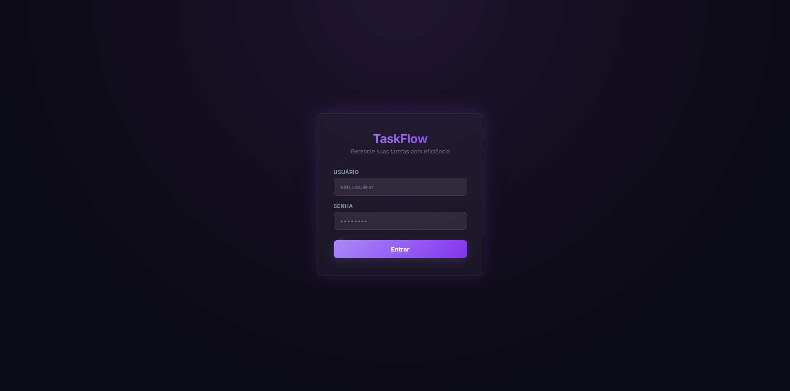
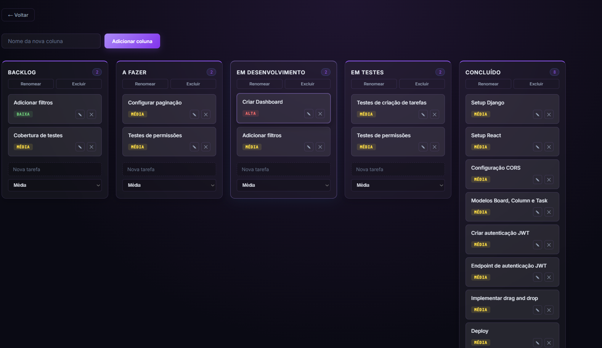
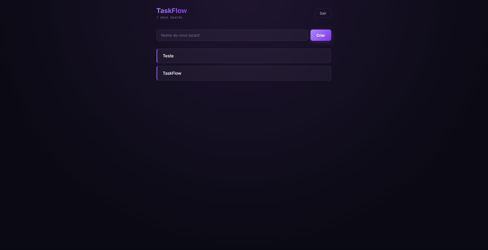

markdown# ⚡ TaskFlow

Aplicação de gerenciamento de tarefas estilo Kanban, desenvolvida com **Django REST Framework** no backend e **React** (Vite) no frontend.

🔗 **[Ver projeto ao vivo](https://taskflow-delta-eight.vercel.app)**

## 📸 Preview

### Login


### Kanban Board


### Gerenciamento de Boards


## 🚀 Funcionalidades

✅ Autenticação com JWT (login e cadastro)
✅ Criar, editar e deletar boards
✅ Criar, editar e deletar colunas
✅ Criar, editar e deletar tarefas
✅ Drag and drop de tarefas entre colunas (com persistência no backend)
✅ Seleção de prioridade ao criar tarefas (baixa, média, alta)
✅ Cada usuário só visualiza seus próprios boards
✅ Interface responsiva com tema dark/SaaS moderno
✅ Deploy containerizado com Docker

## 🛠️ Tecnologias

**Backend:**
- Python
- Django
- Django REST Framework
- Simple JWT (autenticação)
- django-cors-headers
- dj-database-url
- whitenoise
- gunicorn
- SQLite (dev) / PostgreSQL (produção)

**Frontend:**
- React
- Vite
- React Router
- Axios
- @dnd-kit (drag and drop)

## 📁 Estrutura do projeto
taskflow/
├── backend/
│   ├── config/          # configurações Django
│   ├── tasks/           # app principal (models, views, serializers)
│   ├── requirements.txt
│   ├── Procfile
│   ├── railpack.json
│   └── manage.py
└── frontend/
├── src/
│   ├── api/          # configuração do axios
│   ├── pages/        # Login, Boards, Board (Kanban)
│   ├── App.jsx
│   └── main.jsx
├── index.html
├── package.json
└── vite.config.js

## ⚙️ Como rodar localmente

### Backend

```bash
cd backend
python -m venv venv
venv\Scripts\activate          # Windows
pip install -r requirements.txt

python manage.py migrate
python manage.py createsuperuser
python manage.py runserver
```

A API estará disponível em `http://127.0.0.1:8000/api/`

### Frontend

```bash
cd frontend
npm install
npm run dev
```

O frontend estará disponível em `http://localhost:5173`

> Ajuste a URL da API no arquivo `src/api/api.js` caso necessário.

## ☁️ Deploy

### Backend — Railway

O backend está deployado no Railway com banco PostgreSQL.

**URL da API:** `https://taskflow-production-4bc2.up.railway.app/api/`

#### Configuração do Railway

1. Crie um novo projeto no [Railway](https://railway.app)
2. Adicione o serviço via **New → GitHub Repo** e selecione o repositório
3. Em **Settings → Root Directory**, coloque `backend`
4. Adicione um banco de dados via **New → Database → PostgreSQL**
5. Em **Variables**, adicione:
SECRET_KEY=sua-secret-key
DEBUG=False
ALLOWED_HOSTS=seu-projeto.up.railway.app
CSRF_TRUSTED_ORIGINS=https://seu-projeto.up.railway.app
CORS_ALLOWED_ORIGINS=https://seu-frontend.vercel.app

> A variável `DATABASE_URL` é adicionada automaticamente pelo Railway ao conectar o PostgreSQL.

6. No **Console** do serviço, rode as migrations:

```bash
python manage.py migrate
python manage.py createsuperuser
```

### Frontend — Vercel

O frontend está deployado no Vercel.

**URL:** `https://taskflow-delta-eight.vercel.app`

#### Configuração do Vercel

1. Acesse [vercel.com](https://vercel.com) e faça login com o GitHub
2. **New Project → Import Git Repository**
3. Em **Root Directory**, coloque `frontend`
4. Em **Framework Preset**, selecione `Vite`
5. **Build Command:** `npm run build`
6. **Output Directory:** `dist`
7. Clique em **Deploy**

> Antes de fazer o deploy, atualize a URL da API em `src/api/api.js` com a URL do backend no Railway.

#### Atualizações automáticas

Qualquer `git push` na branch `main` dispara re-deploy automático no Railway e no Vercel.

## 📡 Endpoints da API

| Método         | Endpoint                    | Descrição             |
| -------------- | ---------------------------- | ---------------------- |
| POST           | `/api/register/`             | Cadastro de usuário    |
| POST           | `/api/token/`                | Login (JWT)            |
| GET/POST       | `/api/boards/`                | Listar/criar boards    |
| GET/PUT/DELETE | `/api/boards/{id}/`          | Detalhes do board      |
| GET/POST       | `/api/boards/{id}/columns/`  | Colunas                |
| PUT/DELETE     | `/api/columns/{id}/`         | Editar/deletar coluna  |
| GET/POST       | `/api/columns/{id}/tasks/`   | Tarefas                |
| PUT/DELETE     | `/api/tasks/{id}/`           | Editar/deletar tarefa  |
| PATCH          | `/api/tasks/{id}/move/`      | Mover tarefa           |

## 🎯 Próximos passos

- ~~Deploy do backend no Railway~~ ✅
- ~~Deploy do frontend no Vercel~~ ✅
- ~~Reescrita do frontend em React~~ ✅
- ~~Drag and drop de tarefas~~ ✅
- ~~Edição de boards e colunas~~ ✅
- Testes automatizados
- Data de vencimento com alerta visual
- Melhorias de UX/UI (loading states, notificações toast)

## 👤 Autor

Jonatas Doroteu
GitHub · LinkedIn